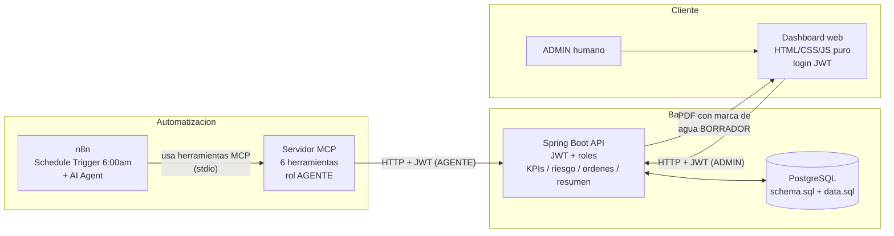

# Diagrama — n8n → MCP → API Spring Boot → PostgreSQL → dashboard

Ver también el diagrama de secuencia (flujo día a día completo, con cada
llamada) en [`sdd/03-diseno.md`](sdd/03-diseno.md#diagrama-de-flujo). Este
es el diagrama de arquitectura/componentes pedido como entregable 11.

- **n8n** consulta riesgo/KPIs y, como máximo, crea una orden en
  `BORRADOR` y publica el resumen — nunca aprueba ni toca la base de
  datos directamente.
- El **servidor MCP** es la única puerta de entrada de n8n hacia la API:
  no accede a PostgreSQL ni implementa reglas de negocio, solo reenvía
  llamadas HTTP autenticadas como `AGENTE`.
- La **API Spring Boot** es la única fuente de verdad: calcula stock,
  riesgo, KPIs, aplica la máquina de estados de la orden y genera el PDF.
- El **dashboard** (mismo origen que la API) es lo que usa el `ADMIN`
  para revisar/aprobar/recibir órdenes y ver el PDF con la marca de agua.
