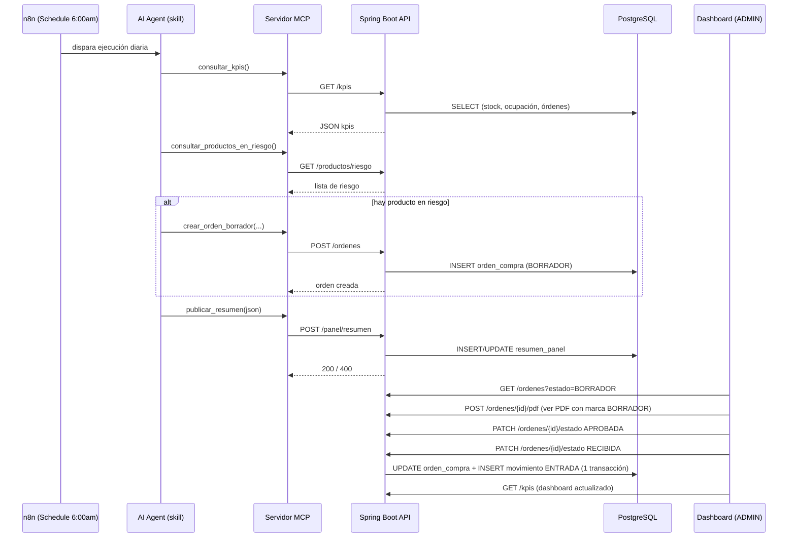

# 03 — Diseño

## Entidades nuevas

```
Proveedor
  id, nombre, contacto, diasEntrega (1..90)

Producto (existente, se agrega)
  proveedorPrincipal -> Proveedor (ManyToOne, opcional)

OrdenCompra
  id, producto -> Producto, proveedor -> Proveedor,
  bodegaDestino -> Bodega, cantidad (>0), precioUnitario, total,
  fechaCreacion, estado (EstadoOrden), creadoPor -> Usuario,
  pdfDocumento (bytea, nullable), pdfGeneradoEn (nullable)

ResumenPanel
  id, fecha (LocalDate, único), contenidoJson (text), autor (Usuario)
```

Enums nuevos: `EstadoOrden {BORRADOR, APROBADA, RECIBIDA, CANCELADA}`,
`EstadoCobertura {SIN_CONSUMO, EN_RIESGO}`, `Severidad {BAJA, MEDIA,
ALTA}`, `TipoAccionResumen {REVISAR_ORDEN, REVISAR_PRODUCTO,
REVISAR_BODEGA}`. `Rol` gana el valor `AGENTE`.

`OrdenCompra` y `ResumenPanel` implementan `Auditable` (igual patrón que
`Producto`/`Bodega`/`Movimiento`), así que su creación/actualización
queda registrada automáticamente por `AuditoriaEntityListener` sin código
adicional — cumple el requisito de auditar creación de orden, transición
de estado y publicación/reemplazo del resumen.

## Decisiones de diseño

1. **Stock derivado, no recalculado en cada llamada desde `movimiento_detalle`
   crudo**: se sigue usando `InventarioBodega` como proyección (ya
   mantenida de forma transaccional por `MovimientoService`), porque el
   enunciado exige que el stock "se calcule a partir de los movimientos"
   y esa tabla ya es, por construcción, la suma de esos movimientos. Los
   servicios nuevos (`RiesgoService`, `KpiService`) leen esa proyección en
   vez de sumar todos los `movimiento_detalle` en cada request — mismo
   resultado, mejor rendimiento, sin tocar la regla de negocio.
2. **Cálculo de cobertura como método de servicio independiente**
   (`RiesgoService.calcularCobertura(productoId)`), reutilizado tanto por
   `GET /productos/riesgo` como por las pruebas unitarias directas — así
   se puede probar "consumo 0 → SIN_CONSUMO" y "stock == reorden → no está
   en riesgo" sin depender de que el producto aparezca en el listado
   público.
3. **Transacción única en la recepción**: `OrdenCompraService.cambiarEstado`
   usa `@Transactional` y, en la transición `APROBADA→RECIBIDA`, delega en
   `MovimientoService` (reutilizado) para crear el `Movimiento` ENTRADA
   dentro de la misma transacción Spring; si `MovimientoService` lanza
   excepción, todo se revierte (rollback), incluida la actualización de
   estado.
4. **PDF con PDFBox**: se elige Apache PDFBox (Apache 2.0, sin
   dependencias nativas) para evitar licencias comerciales. El PDF se
   guarda como `byte[]`/`bytea` en `orden_compra`, no en disco, para que
   el backend siga siendo la única fuente de verdad (el archivo viaja con
   la fila).
5. **Contrato del resumen validado con Bean Validation + una validación de
   servicio** (para "cada ID debe existir" y "una alerta enlaza al menos
   un id / una acción enlaza exactamente uno", reglas que no expresa
   `jakarta.validation` por sí solo). `@JsonIgnoreProperties(ignoreUnknown
   = false)` en el DTO raíz rechaza propiedades no declaradas, tal como
   pide el contrato ("no admite propiedades adicionales").
6. **Rol `AGENTE` vía `@PreAuthorize` por endpoint**, no por prefijo de
   ruta en `SecurityConfig`, porque las reglas dependen del método HTTP y
   de casos finos (p. ej. `POST /ordenes` sí, `PATCH .../estado` no) que
   se expresan mejor a nivel de método que de matcher genérico.
7. **MCP en Node.js (stdio)**: es el transporte más simple de ejecutar
   localmente (el propio n8n o un cliente MCP lo lanza como subproceso),
   no requiere exponer un puerto adicional, y el SDK oficial
   (`@modelcontextprotocol/sdk`) ya resuelve el framing JSON-RPC.
8. **Pruebas contra H2 en memoria** (no contra la Postgres remota de
   `application.properties`, ni Testcontainers): este entorno de
   desarrollo no tiene Docker, y usar la base compartida ensuciaría los
   datos de demo del video. `src/test/resources/application.properties`
   apunta a H2 con `ddl-auto=create-drop`, dejando que Hibernate derive el
   esquema (incluidos los enums nativos vía `@JdbcTypeCode(NAMED_ENUM)`)
   directamente de las entidades — mismo modelo, sin depender de
   `schema.sql` (que sí es específico de PostgreSQL).

## Diagrama de flujo


